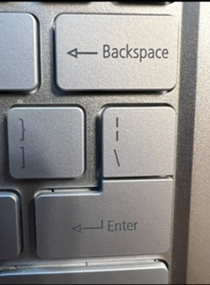

# Let's Write Good Documenation

## Step 1 - Using Codeblocks.

Codeblocks in markdown makes it *easier* for others to **copy, paste and share** code.
Cloud Engineers uses codeblocks whenever possible.

It allows others to replicate and reseacrh issues.

- In order to create codeblocks uses backticks ``` and not quotations (')


### Example Codeblock with Go
```
package main

import "fmt"

func main() {
    fmt.Println("Hello, World!")
}
```

- When you can apply syntax highlighting to your codeblocks.


```go
package main

import "fmt"

func main() {
    fmt.Println("Hello, World!")
}
```

- Make note of backtick key button is located, on the tidle key.
- Above tab key.


 


Good Cloud Engineers use codeblocks for both Code and Errors that appear in the console.


```bash
panic: runtime error: integer divide by zero
```

> Here is an example of a codeblock for an error that appears in bash.

When you can always use codeblocks instead of screenshots.

> Only in certain cases are photos from phone acceptable, like if computer wont boot.

## Step 2 - How To Take Screenshots

A screenshot is when you capture a part of your screen from your laptop, desktop or phone.

**Do not take a photo with your phone.**

Taking screenshots on macOS, Windows, and Linux can be done using hotkeys or keyboard shortcuts. Here are the common hotkeys for each operating system:

**MacOS:**

1. **Capture Entire Screen**: 
   - Press `Command (⌘) + Shift + 3`.

2. **Capture Selected Portion of the Screen (screenshot to clipboard)**: 
   - Press `Command (⌘) + Shift + 4`, then drag to select the area you want to capture. The screenshot will be copied to your clipboard.

3. **Capture Selected Portion of the Screen (screenshot saved to desktop)**: 
   - Press `Command (⌘) + Shift + 4`, then press the `Spacebar`. Click on the window or area you want to capture. The screenshot will be saved to your desktop.

**Windows:**

1. **Capture Entire Screen**: 
   - Press `PrtScn` (Print Screen) key. This will capture the entire screen to your clipboard.

2. **Capture Active Window**: 
   - Press `Alt + PrtScn`. This captures only the active window and copies it to your clipboard.

3. **Capture Selected Portion of the Screen (Windows 10 and later)**:
   - Press `Windows + Shift + S` to open the Snip & Sketch tool. Then, select the area you want to capture.

4. **Capture Entire Screen and Save as File (Windows 10 and later)**:
   - Press `Windows + Shift + S`, then click the "Screen snip" option. This will allow you to capture and save the screenshot.

**Linux:**

1. **Capture Entire Screen**:
   - On many Linux distributions, you can use the `PrtScn` key to capture the entire screen. The screenshot is usually saved to your Pictures folder.

2. **Capture Selected Portion of the Screen**:
   - Press `Shift + PrtScn` or `Alt + PrtScn`, depending on your Linux distribution and desktop environment. This allows you to select an area for capture.

Please note that the exact key combinations and available options may vary slightly depending on your specific Linux distribution and desktop environment. Additionally, you can often customize these shortcuts or use third-party screenshot tools for more advanced features.

## Step -3 Use GitHub Flavored Task Lists

GitHub extends Markdown to include check off lists. [<sup>[1]</sup>](#references)

- [x] Finish Step 1
- [x] Finish Step 2
- [x] Finish Step 3
- [x] Finish Step 4
- [x] Finish Step 5

  
## Step 4 - Use Emojis

GitHub Flavored Markdown (GFM) supports emoji shortcodes.
Here are some examples:

| Name | Shortcode | Emoji |
| --- | --- | --- |
| Cloud | `:cloud:` | :cloud: |
| Face in Clouds | `face_in_clouds:` | 😶‍🌫️: |

## Step 5 - How To Create A Table

You can use the example markdown to create tables. [<sup>[2]</sup>](#references)

- Make note of pipe key button is located.
- Above Enter key.



```md
| Name | Shortcode | Emoji |
| --- | --- | --- |
| Cloud | `:cloud:` | :cloud: |
| Face in Clouds | `face_in_clouds:` | 😶‍🌫️: |
```

[Secrets Past](secrets/past.md)

## References

- [Getting started with writing and formatting on GitHub](https://docs.github.com/en/get-started/writing-on-github/getting-started-with-writing-and-formatting-on-github/basic-writing-and-formatting-syntax)
- [GitHub Flavored Markdown Spec](https://github.github.com/gfm/)
- [GFM - Tasks Lists](https://docs.github.com/en/get-started/writing-on-github/getting-started-with-writing-and-formatting-on-github/basic-writing-and-formatting-syntax#task-lists) <sup>[1]</sup>
- [GFM - Emoji Cheat Sheet](https://github.com/ikatyang/emoji-cheat-sheet/blob/master/README.md)
- [GFM - Tables(with extensions)](https://github.github.com/gfm/#tables-extension-) <sup>[2]</sup>
